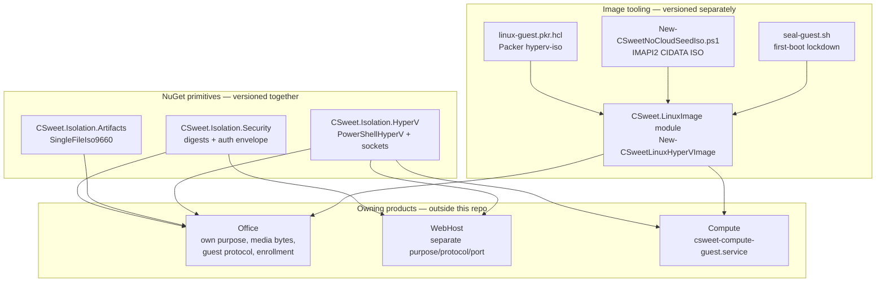
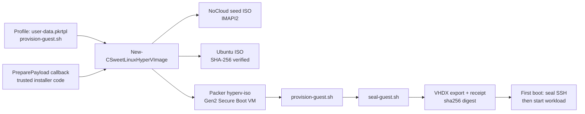

# Architecture

## Solution map

## Component responsibilities

### CSweet.Isolation.Security (`src/CSweet.Isolation.Security`)

Single static class: `WorkloadAuthorizationEnvelope`.

- `Digest(string)` — canonical `sha256:<64 lowercase hex>` reference for any string.
- `IsDigest(string?)` — strict validator (length 71, prefix, hex alphabet).
- `Encode(purpose, version, hostId, assignmentId, workloadId, epoch, providerId, digest, issuedAt, expiresAt)` — deterministic big-endian binary encoding. Each execution service supplies its own immutable `purpose` string, which domain-separates otherwise identical fields.

No signing, no encryption, no storage. Just encoding + digest rules. See
`security-primitives.md`.

### CSweet.Isolation.Artifacts (`src/CSweet.Isolation.Artifacts`)

Single static class: `SingleFileIso9660`.

- `WriteAsync(artifact, artifactLength, output, ct)` — deterministic ISO-9660
  image containing exactly one file, `ARTIFACT.CSAB;1`, at fixed sector 21.
- `VerifyArtifactDigestAsync(isoPath, expectedDigest, ct)` — parses the PVD,
  locates the artifact record, streams the extent through SHA-256, compares in
  fixed time. Returns `false` (never throws for bad input) on any mismatch.

Deliberately not a general ISO parser or authoring surface. The virtual DVD is
a hypervisor-enforced read-only transport. See `artifact-media.md`.

### CSweet.Isolation.HyperV (`src/CSweet.Isolation.HyperV`)

Three pieces:

1. `PowerShellHyperV` — static helpers that shell out to Windows PowerShell
   (`powershell.exe`, not `pwsh`) with Base64-encoded scripts passed via
   environment variables: `CreateShellAsync`, `ConfigureAsync`, `StartAsync`,
   `StopAsync`, `DestroyAsync`, `GetStateAsync`, plus `RunAsync` for ad-hoc
   scripts. All output capped at 64 KiB; errors sanitized (CLIXML decoded,
   stack frames stripped, max 4 lines / 1024 chars). Throws
   `HyperVCommandException` with machine-readable `ErrorCode`.
2. `WindowsHyperVSocketTransport` (host side) — connects over AF_HYPERV (family
   34) to a VM GUID + service GUID derived from the Linux VSOCK port
   (`{port:x8}-facb-11e6-bd58-64006a7986d3`). Non-blocking poll loop with
   configurable timeout/retry. Requires Windows.
3. `LinuxHyperVSocketGuestTransport` (guest side) — raw `libc` P/Invoke
   (`socket`/`bind`/`listen`/`accept4` on AF_VSOCK family 40) because .NET's
   Linux `SocketPal` does not map AF_VSOCK. Accepts one connection, returns
   split `GuestStreamConnection(Input, Output)` FileStreams for full duplex.
   Requires Linux.

See `hyperv.md`.

### CSweet.LinuxImage (`tools/LinuxImage`)

Installer-owned PowerShell module. Single exported function
`New-CSweetLinuxHyperVImage` orchestrates: host checks → tool/cache setup →
payload callback → temp SSH keys → NoCloud seed ISO → verified Ubuntu/Packer
downloads → `packer init` → `packer validate` → `packer build` → VHDX export +
SHA-256 receipt. `seal-guest.sh` installs a first-boot systemd unit that
removes build-time SSH access before the workload service starts. See
`linux-image.md`.

## Data flow

### Authorization (per workload)

1. Owner computes artifact digest via `Digest` / `IsDigest`.
2. Owner calls `Encode` with its service `purpose` (e.g. Office keeps its own;
   WebHost uses a different one — cross-service tokens never validate).
3. Owner signs/transports the bytes by its own mechanism (outside this repo).
4. Guest/host verifies purpose, expiry, digest before use.

### Artifact delivery (Office path)

1. Host builds ISO via `SingleFileIso9660.WriteAsync`.
2. `PowerShellHyperV.ConfigureAsync` attaches the ISO as a DVD drive
   (SCSI 0:2, optional bootstrap at 0:3) alongside differencing OS disk and
   dynamic scratch disk.
3. Guest reads the read-only DVD; host can re-verify with
   `VerifyArtifactDigestAsync`.

### Guest channel (Hyper-V sockets / VSOCK)

1. Guest boots, seals SSH, listens on VSOCK port (default 2761) via
   `LinuxHyperVSocketGuestTransport.AcceptAsync`.
2. Host connects via `WindowsHyperVSocketTransport.ConnectAsync(vmId)`
   using the service GUID derived from the same port.
3. Both sides speak the owning product's protocol (Office and WebHost use
   different protocols/ports — this library only moves bytes).

### Image build

## Key invariants

- All three NuGet packages share one `Version` in `Directory.Build.props`.
  Bump once, release all three together.
- The Linux image module version (`CSweet.LinuxImage.psd1`) is independent.
- Existing output VHDXs are never overwritten; concurrent builds fail fast on
  an exclusive lock (`image-build.lock`).
- A build receipt records bytes, not certification. Release signing, runtime
  certification, protected-template installation, and workload grants belong to
  owning products.
- Office compatibility (its purpose string, media bytes, guest protocol, and a
  captured 0.5.0 encoding vector + regression suite) is preserved; WebHost
  deliberately diverges with its own purpose/protocol/port.
