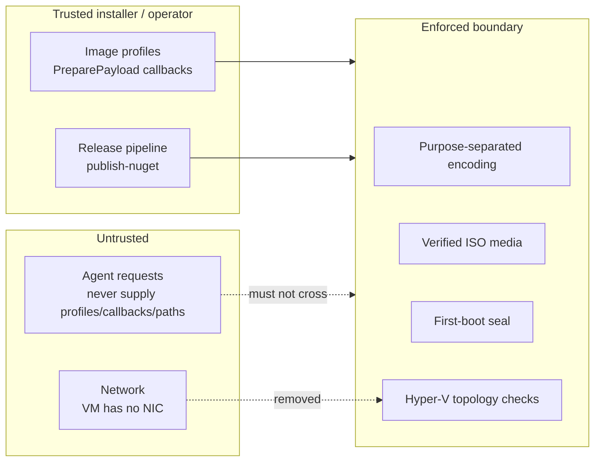

# Security model

## What this repo guarantees

- **Deterministic encoding** — same authorization fields + purpose always
  produce the same bytes (`WorkloadAuthorizationEnvelope`).
- **Strict digests** — only canonical `sha256:<64 lowercase hex>` references
  are accepted anywhere.
- **Purpose separation** — Office and WebHost tokens are mutually unintelligible
  by construction (different `purpose` strings).
- **Verified media** — ISO artifacts are hash-verified on write-path and
  re-verified on receipt with fixed-time comparison.
- **Bounded host commands** — Hyper-V operations run fixed scripts with
  timeouts, output caps, sanitized errors, and topology validation (0 NICs,
  exact disk/DVD counts, Secure Boot on).
- **Sealed guests** — image builds remove SSH, sudoers entries, and lock the
  build account on first boot before any workload starts.

## Trust boundaries

- Profiles and `PreparePayload` callbacks are **trusted installer code**.
  Never accept them from an agent request, and never let agent input choose
  host paths, switch names, or service names.
- The restricted VM has **no network adapter** — enforced at creation and
  re-validated at configure time. Artifact ingress is via read-only DVD;
  command channel is via Hyper-V sockets.
- Build-time SSH (temp ed25519 key, `csweet-image` account, sudoers entry) is
  a deliberate, short-lived exception confined to the Packer build. It is
  removed on first boot; the seal unit gates the workload service on its
  completion.

## Explicit non-goals (do not assume)

These primitives **alone** do not provide or certify a complete product
isolation boundary:

- No enrollment, credentials, workload execution, or runtime policy.
- No release signing, runtime certification, protected-template installation,
  or workload grants (owning products).
- No key management, revocation, or clock-skew policy for authorization tokens.
- No general ISO parsing, no networked guest services, no multi-tenant
  scheduling.
- A build receipt (`Sha256` + paths) records bytes — it is not image
  certification and confers no execution authority.

## Operator rules

1. Run image builds only from an Administrator prompt on a trusted host.
2. Verify Ubuntu + Packer checksums (the module does; never bypass with
   pre-seeded cache files of unknown origin).
3. Never overwrite existing templates; never accept a VHDX as a template
   without the owning product's certification flow.
4. Never publish from a dev runner — only `publish-nuget` (OIDC) pushes.
5. Treat `artifacts/` as ephemeral; failed-build directories may contain
   sensitive temp state — inspect, then clean up deliberately.
